# CoupleFlow AI — Couples Financial Assistant
## Product & Architecture Plan

---

## 1. Vision

CoupleFlow AI is a **goal-driven financial assistant for couples**. It doesn't just track money — it predicts a path to financial success. Whether a couple wants to eliminate debt, build an emergency fund, or save for a dream vacation, the AI creates a personalized, month-by-month roadmap and guides them together through every milestone.

**Core Principle:** The AI is a financial co-pilot, not an autopilot. It builds the plan, the couple owns it.

---

## 2. System Architecture

### 2.1 High-Level Architecture

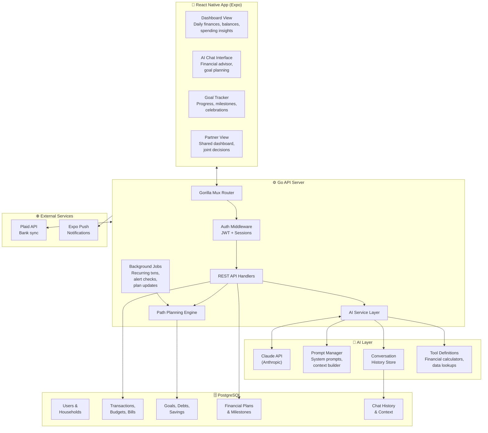

### 2.2 AI Service Architecture (Detail)

```mermaid
graph LR
    subgraph Request["User Message"]
        Msg["'How fast can we<br/>pay off our credit cards?'"]
    end

    subgraph ContextBuilder["Context Builder"]
        Profile["User Profile<br/>Income, expenses,<br/>risk tolerance"]
        FinSnap["Financial Snapshot<br/>Balances, debts,<br/>monthly cash flow"]
        GoalCtx["Active Goals<br/>Current plans,<br/>progress"]
        PartnerCtx["Partner Context<br/>Shared vs individual,<br/>permissions"]
    end

    subgraph ClaudeCall["Claude API Call"]
        SysPrompt["System Prompt<br/>Financial advisor<br/>persona + rules"]
        Tools["Tool Use<br/>calculate_payoff<br/>project_savings<br/>simulate_budget"]
        Response["Structured Response<br/>Analysis + Plan +<br/>Action Items"]
    end

    subgraph Output["Response to User"]
        Chat["Conversational<br/>explanation"]
        Visual["Charts &<br/>projections"]
        Actions["Actionable<br/>next steps"]
    end

    Msg --> ContextBuilder
    ContextBuilder --> ClaudeCall
    ClaudeCall --> Output
```

---

## 3. AI Assistant Design

### 3.1 Hybrid UX Model

The app uses a **dashboard + AI chat** hybrid. The dashboard handles daily financial viewing; the AI chat handles planning, advice, and goal creation.

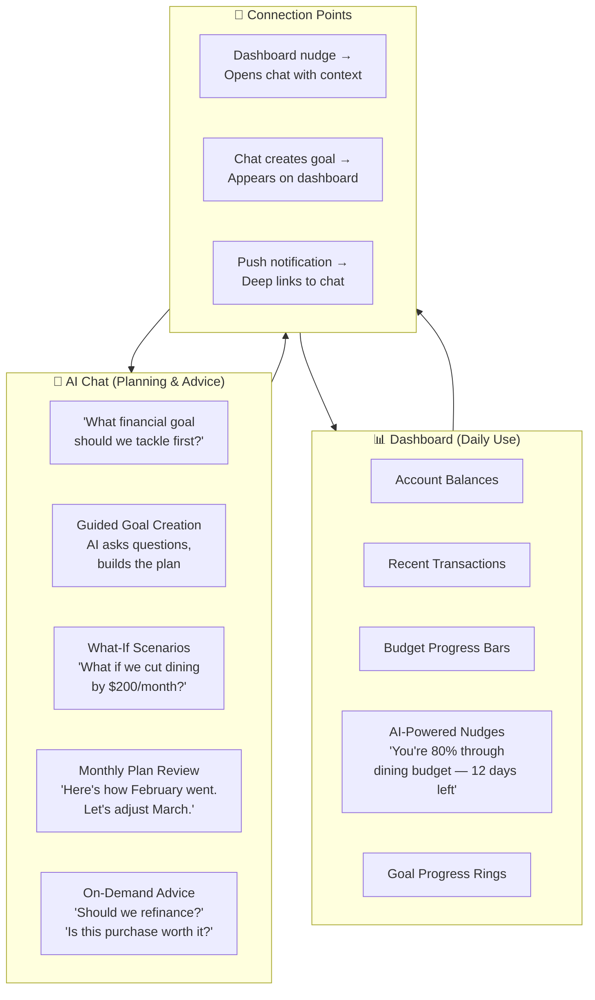

### 3.2 AI Persona & Capabilities

The AI assistant has a defined persona and bounded capabilities:

**Persona:** Warm, knowledgeable financial advisor who understands couples dynamics. Never judgmental about spending. Celebrates wins. Speaks plainly — no jargon.

**Can Do:**
- Analyze spending patterns and predict future cash flow
- Create debt payoff plans (avalanche, snowball, hybrid)
- Project savings timelines for goals
- Simulate "what-if" budget scenarios
- Generate month-by-month financial roadmaps
- Provide couple-aware advice (fair splitting, shared goals)
- Send proactive check-ins and nudges

**Cannot Do:**
- Execute transactions or move money
- Provide tax advice or legal guidance
- Access accounts the user hasn't linked
- Make decisions without couple consensus

---

## 4. Goal Path Planning Engine

This is the core differentiator — the AI doesn't just track goals, it **plans the path** to reach them.

### 4.1 Path Planning Flow

```mermaid
flowchart TD
    Start([Couple Opens Goal Planner]) --> Gather

    subgraph Gather["📋 Step 1: Gather Context"]
        Income["Combined Monthly Income"]
        Expenses["Fixed & Variable Expenses"]
        Debts["All Debts<br/>(balances, rates, minimums)"]
        Savings["Current Savings &<br/>Emergency Fund"]
        Linked["Plaid-Linked Accounts<br/>(auto-populated)"]
    end

    Gather --> Goals

    subgraph Goals["🎯 Step 2: Define Goals"]
        G1["Goal 1: Emergency Fund<br/>$10,000 target"]
        G2["Goal 2: Pay Off Credit Cards<br/>$8,500 total"]
        G3["Goal 3: Vacation Fund<br/>$3,000 by December"]
    end

    Goals --> Prioritize

    subgraph Prioritize["⚖️ Step 3: AI Prioritizes"]
        Risk["Risk Assessment<br/>No emergency fund = high risk"]
        Math["Financial Math<br/>High-APR debt costs $X/month"]
        Pref["Couple Preferences<br/>What matters most to you?"]
        Rec["AI Recommendation<br/>Suggested priority order<br/>with reasoning"]
    end

    Prioritize --> Plan

    subgraph Plan["🗺️ Step 4: Generate Path"]
        M1["Month 1-3:<br/>Build $1,000 starter<br/>emergency fund"]
        M2["Month 4-8:<br/>Avalanche attack on<br/>credit card debt"]
        M3["Month 9-11:<br/>Grow emergency fund<br/>to $10,000"]
        M4["Month 12:<br/>Vacation fund sprint<br/>+ celebration!"]
    end

    Plan --> Review

    subgraph Review["👫 Step 5: Couple Review"]
        Show["Present plan to<br/>both partners"]
        Adjust["Allow adjustments<br/>'Can we start vacation<br/>saving sooner?'"]
        Commit["Both partners<br/>commit to plan"]
    end

    Review --> Execute

    subgraph Execute["🚀 Step 6: Execute & Track"]
        Monthly["Monthly check-ins<br/>AI reviews progress"]
        Adapt["Adaptive replanning<br/>Income changed?<br/>Unexpected expense?"]
        Celebrate["Milestone celebrations<br/>🎉 Debt #1 paid off!"]
    end

    Execute -->|"Life happens"| Gather
```

### 4.2 Financial Framework: The CoupleFlow Method

The AI follows a structured framework for financial success — a guided sequence the couple progresses through:

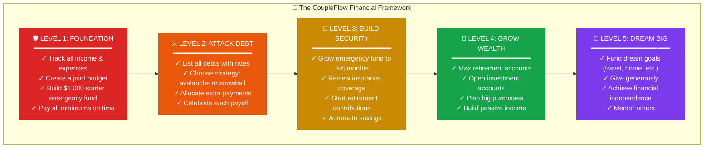

### 4.3 Path Prediction Algorithm

The AI uses a combination of Claude's reasoning and deterministic calculations:

```mermaid
flowchart LR
    subgraph Inputs["Inputs"]
        I1["Monthly take-home pay"]
        I2["Fixed expenses"]
        I3["Variable spending<br/>(3-month average)"]
        I4["Debt details<br/>(balance, APR, min)"]
        I5["Current savings"]
        I6["Goal targets & dates"]
    end

    subgraph Calculation["Calculation Engine (Go)"]
        CF["Cash Flow Analysis<br/>Income - Fixed - Variable<br/>= Available monthly"]
        Debt["Debt Payoff Simulator<br/>Avalanche/Snowball/Hybrid<br/>Month-by-month projection"]
        Save["Savings Projector<br/>Compound interest,<br/>contribution schedule"]
        Risk["Risk Scorer<br/>Months of runway,<br/>debt-to-income ratio"]
    end

    subgraph Claude["Claude AI Layer"]
        Optimize["Optimize Allocation<br/>How much to each goal<br/>per month?"]
        Scenario["Scenario Generation<br/>Best case / Expected /<br/>Conservative"]
        Explain["Natural Language<br/>Explanation<br/>Why this path works"]
        Couple["Couple-Aware Advice<br/>Fair contribution splits,<br/>shared vs. personal goals"]
    end

    subgraph Output["Plan Output"]
        Timeline["Month-by-Month<br/>Timeline"]
        Milestones["Key Milestones<br/>& Celebrations"]
        Actions["Monthly Action Items<br/>for Each Partner"]
        Projections["Visual Projections<br/>Charts & Graphs"]
    end

    Inputs --> Calculation --> Claude --> Output
```

---

## 5. Couple Collaboration Model

### 5.1 Partner Decision Flow

Financial plans require both partners to agree. The AI facilitates this:

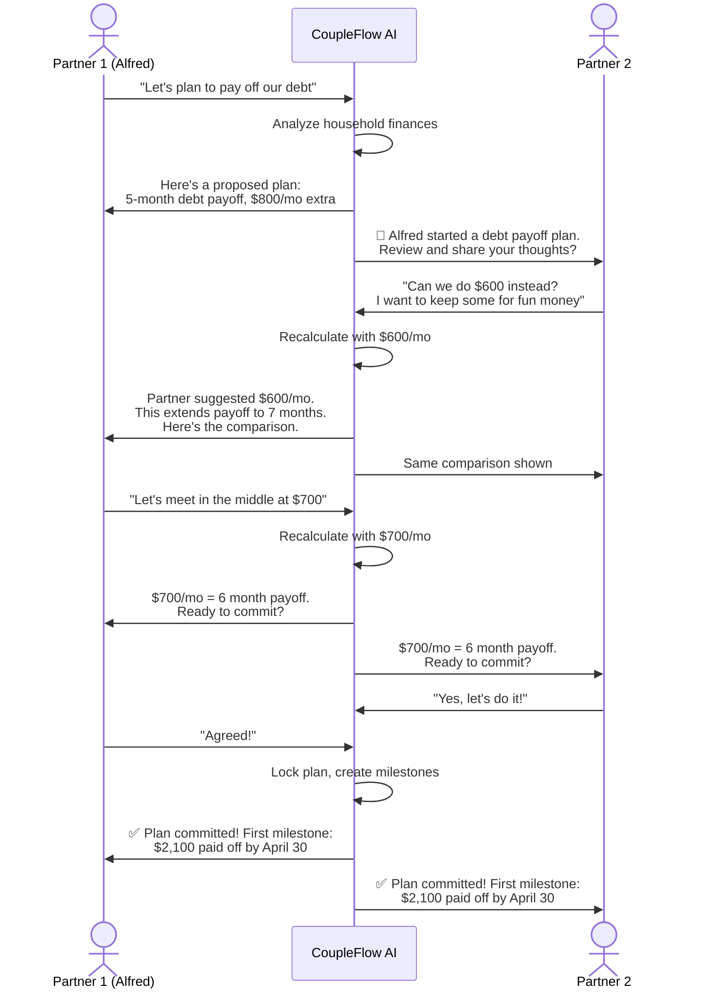

### 5.2 Shared vs. Personal Goals

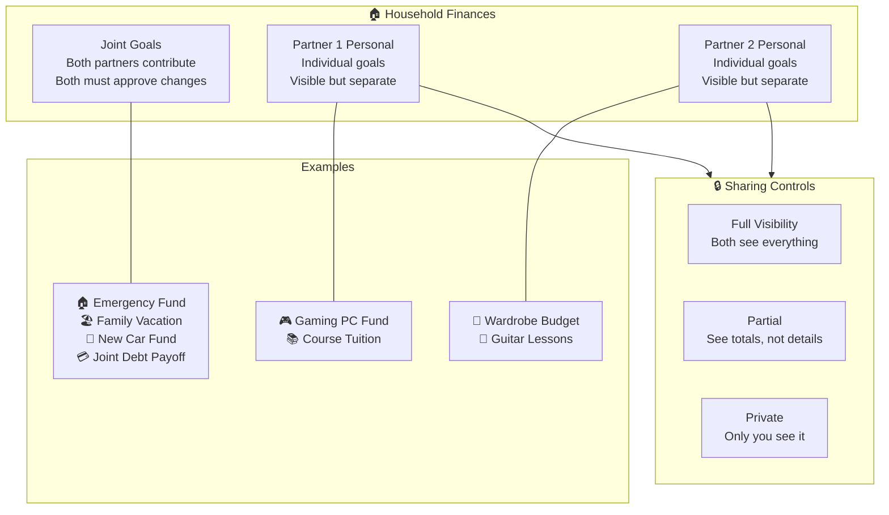

---

## 6. Data Model (New Tables)

These additions extend the existing PostgreSQL schema:

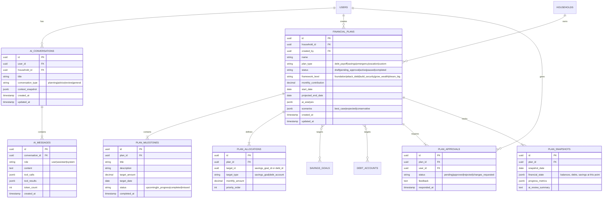

---

## 7. API Design (New Endpoints)

### 7.1 AI Chat Endpoints

```
POST   /auth/ai/conversations                  Create new conversation
GET    /auth/ai/conversations                  List user's conversations
GET    /auth/ai/conversations/:id              Get conversation with messages
POST   /auth/ai/conversations/:id/messages     Send message (streams response)
DELETE /auth/ai/conversations/:id              Delete conversation
```

### 7.2 Financial Plan Endpoints

```
POST   /auth/plans                              Create plan (AI generates)
GET    /auth/plans                              List household plans
GET    /auth/plans/:id                          Get plan with milestones
PUT    /auth/plans/:id                          Update plan
POST   /auth/plans/:id/approve                  Partner approves plan
POST   /auth/plans/:id/reject                   Partner rejects with feedback
POST   /auth/plans/:id/pause                    Pause plan
POST   /auth/plans/:id/resume                   Resume plan
POST   /auth/plans/:id/recalculate              AI recalculates based on new data
GET    /auth/plans/:id/scenarios                Get best/expected/conservative
GET    /auth/plans/:id/progress                 Current progress vs. plan
POST   /auth/plans/:id/snapshots                Create monthly snapshot
```

### 7.3 AI Insight Endpoints

```
GET    /auth/ai/nudges                          Get current AI nudges for dashboard
GET    /auth/ai/framework-level                 Get couple's current framework level
POST   /auth/ai/what-if                         Simulate a scenario
GET    /auth/ai/monthly-review                  Generate monthly review
```

---

## 8. Claude Integration Design

### 8.1 Tool Definitions for Claude

The AI assistant uses Claude's **tool use** feature to access real financial data:

```
┌─────────────────────────────────────────────────────────┐
│ Claude Tool Definitions                                  │
├─────────────────────────────────────────────────────────┤
│                                                          │
│ get_financial_snapshot                                    │
│   → Returns: income, expenses, balances, net worth       │
│                                                          │
│ get_debts                                                │
│   → Returns: all debts with balances, APRs, minimums     │
│                                                          │
│ get_savings_goals                                        │
│   → Returns: all goals with current/target amounts       │
│                                                          │
│ get_spending_by_category                                 │
│   → Params: months (1-12)                                │
│   → Returns: categorized spending averages               │
│                                                          │
│ calculate_debt_payoff                                    │
│   → Params: strategy, extra_payment                      │
│   → Returns: month-by-month payoff schedule              │
│                                                          │
│ project_savings                                          │
│   → Params: monthly_amount, target, interest_rate        │
│   → Returns: timeline with compound growth               │
│                                                          │
│ simulate_budget_change                                   │
│   → Params: category, new_amount                         │
│   → Returns: impact on cash flow and goals               │
│                                                          │
│ create_financial_plan                                    │
│   → Params: goals, monthly_budget, strategy              │
│   → Returns: full plan object saved to DB                │
│                                                          │
│ get_partner_status                                       │
│   → Returns: partner's pending reviews, shared goals     │
│                                                          │
└─────────────────────────────────────────────────────────┘
```

### 8.2 System Prompt Architecture

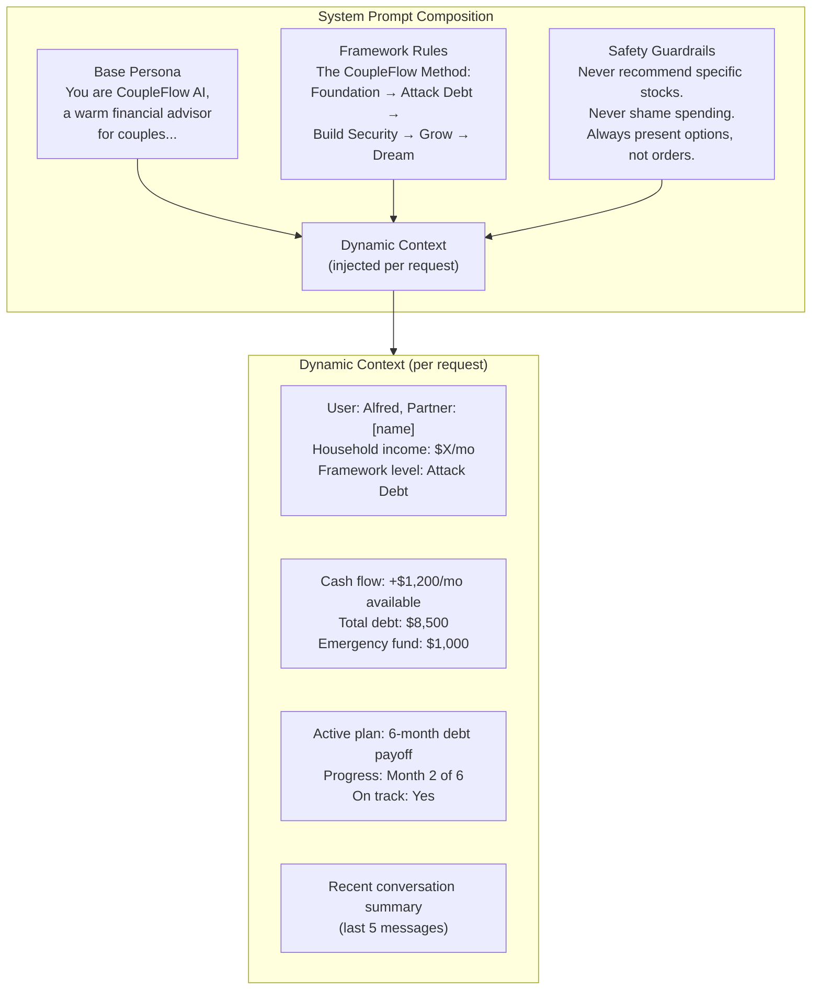

---

## 9. UX Flow: Key Screens

### 9.1 Navigation Architecture

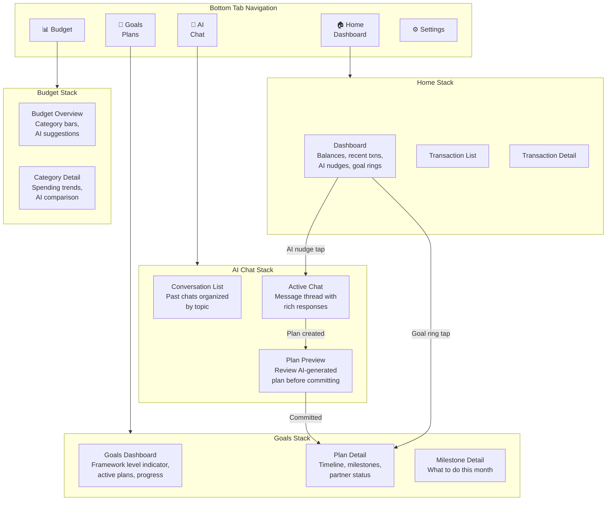

### 9.2 AI Chat Interface Concept

```
┌──────────────────────────────────────┐
│  ← CoupleFlow AI          🔄 New    │
├──────────────────────────────────────┤
│                                      │
│  ┌────────────────────────────────┐  │
│  │ 🤖 Based on your finances,    │  │
│  │ here's what I recommend:      │  │
│  │                                │  │
│  │ You have $1,200/mo available   │  │
│  │ after expenses. Here's a plan: │  │
│  │                                │  │
│  │ ┌──────────────────────────┐  │  │
│  │ │ 📊 6-Month Debt Freedom  │  │  │
│  │ │                          │  │  │
│  │ │ Month 1-2: Pay off Visa  │  │  │
│  │ │ Month 3-5: Pay off Amex  │  │  │
│  │ │ Month 6: Build savings   │  │  │
│  │ │                          │  │  │
│  │ │ Total interest saved:    │  │  │
│  │ │ $847 vs minimum payments │  │  │
│  │ │                          │  │  │
│  │ │ [View Full Plan]         │  │  │
│  │ └──────────────────────────┘  │  │
│  │                                │  │
│  │ Want me to adjust anything?    │  │
│  └────────────────────────────────┘  │
│                                      │
│         ┌──────────────────────┐     │
│         │ What if we put $800  │     │
│         │ instead of $700?     │     │
│         └──────────────────────┘     │
│                                      │
├──────────────────────────────────────┤
│  ┌──────────────────────────────┐   │
│  │ Ask CoupleFlow AI...     📎 🎤│   │
│  └──────────────────────────────┘   │
│                                      │
│  Quick: [Review my month]           │
│         [What-if scenario]           │
│         [Adjust our plan]            │
└──────────────────────────────────────┘
```

---

## 10. Background Intelligence

### 10.1 Proactive AI Features

The AI doesn't wait to be asked — it proactively monitors and nudges:

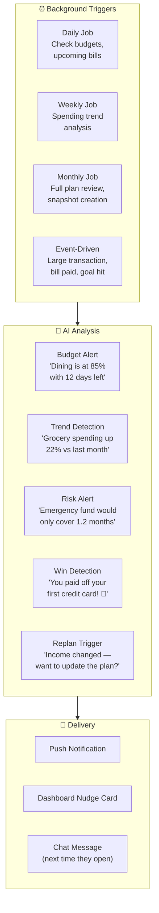

---

## 11. Implementation Phases

### Phase 1: AI Foundation (Weeks 1-3)
- Claude API integration in Go backend
- Conversation storage (new DB tables + migrations)
- Basic AI chat endpoint with streaming
- System prompt with financial advisor persona
- Tool definitions: `get_financial_snapshot`, `get_debts`, `get_savings_goals`
- Frontend: AI chat screen with message UI

### Phase 2: Path Planning Engine (Weeks 4-6)
- Debt payoff calculator (avalanche/snowball/hybrid)
- Savings projection calculator
- Cash flow analyzer
- Financial plan data model + API
- Claude tool: `calculate_debt_payoff`, `project_savings`, `create_financial_plan`
- Frontend: Plan creation flow, plan detail view

### Phase 3: Couple Collaboration (Weeks 7-8)
- Plan approval/rejection flow
- Partner notifications for plan reviews
- Shared vs. personal goal visibility
- Couple decision negotiation via AI
- Frontend: Partner review screens, approval UI

### Phase 4: Framework & Milestones (Weeks 9-10)
- CoupleFlow Method framework level tracking
- Milestone creation and tracking
- Monthly snapshot system
- Progress visualization
- Frontend: Goals dashboard with framework level, milestone cards

### Phase 5: Proactive Intelligence (Weeks 11-12)
- Background jobs for budget monitoring
- AI nudge generation system
- Monthly review automation
- What-if scenario simulator
- Dashboard nudge cards
- Push notification integration

### Phase 6: Polish & Launch (Weeks 13-14)
- UX refinement (glassmorphic design alignment)
- Error handling and edge cases
- Performance optimization
- Testing (unit, integration, E2E)
- App Store preparation

---

## 12. Tech Decisions

| Decision | Choice | Rationale |
|----------|--------|-----------|
| AI Provider | Claude (Anthropic) | Superior reasoning for financial analysis, excellent tool use, conversational quality |
| AI Communication | Server-side streaming (SSE) | Real-time response feel, backend controls context and tools |
| Conversation Storage | PostgreSQL (not vector DB) | Conversations are structured, not semantic search — relational fits |
| Financial Calculations | Go (deterministic) | Debt payoff and savings math must be exact — not AI-generated |
| Plan Explanations | Claude (conversational) | Why this plan works, trade-offs, advice — Claude's strength |
| Background Jobs | Go cron scheduler | Already have scheduler infrastructure, keep it simple |
| Prompt Management | Go templates + DB config | Version and A/B test prompts without redeployment |

---

## 13. Security & Privacy Considerations

- All financial data stays server-side; Claude only receives aggregated summaries, never raw bank credentials
- Conversation history encrypted at rest
- Partner can only see shared goals and joint conversations (respects sharing_preferences)
- AI never stores or logs Plaid tokens
- Rate limiting on AI endpoints (prevent abuse and cost overruns)
- Monthly cost monitoring for Claude API usage
- Users can delete all AI conversation history

---

*This plan builds on the existing CoupleFlow codebase (~55% MVP complete) and adds the AI assistant layer as the primary differentiator. The goal-path planning engine transforms the app from a tracker into a true financial success partner for couples.*
