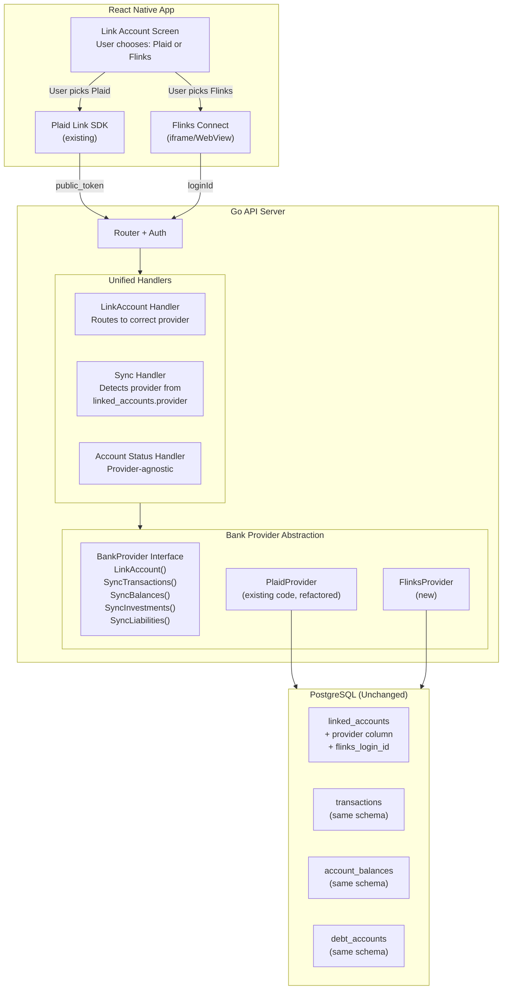
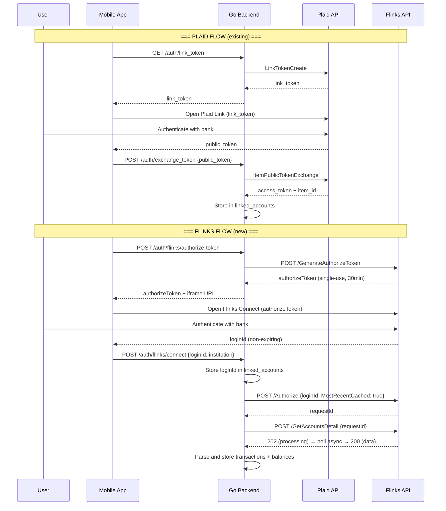
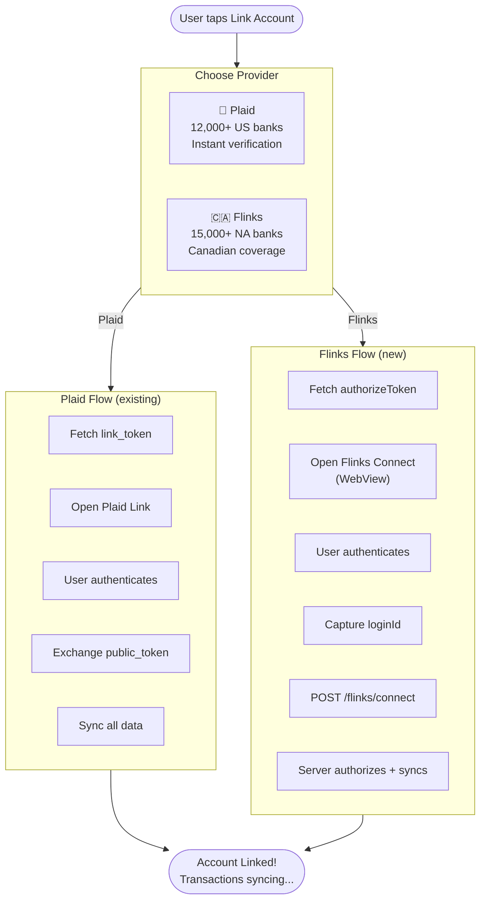
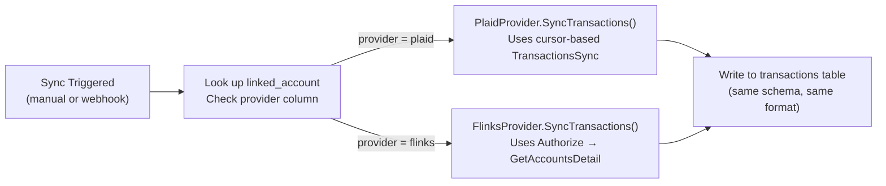

# Flinks Integration Plan — Provider Choice Architecture

## Overview

Add Flinks as an alternative bank connection provider alongside the existing Plaid integration. Users choose their provider when linking a new account. Both providers feed into the same unified data layer (transactions, balances, debts, etc.).

---

## 1. Architecture: Provider Abstraction Layer

The key design decision is to create a **BankProvider interface** that both Plaid and Flinks implement. This keeps the rest of the app (handlers, AI tools, frontend screens) completely agnostic to which provider was used.



---

## 2. Flinks API Flow (vs Plaid)

### Side-by-Side Comparison



### Key Differences

| Aspect | Plaid | Flinks |
|--------|-------|--------|
| **Frontend Widget** | Plaid Link SDK (native + JS) | Flinks Connect (iframe/WebView) |
| **Auth Token** | link_token (15 min) | authorizeToken (30 min, single-use) |
| **User Identifier** | access_token + item_id | loginId (non-expiring) |
| **Data Retrieval** | Direct API calls (sync) | Async polling (202 → poll → 200) |
| **Transactions** | TransactionsSync (cursor-based, incremental) | GetAccountsDetail (includes txns) |
| **Balances** | AccountsGet (direct) | GetAccountsSummary (direct) |
| **Webhooks** | Rich webhook system (TRANSACTIONS, ITEM, etc.) | Webhook callbacks for GetAccountsDetail |
| **Coverage** | 12,000+ US institutions | 15,000+ North American institutions |
| **Auth Headers** | x-api-key in request | flinks-auth-key header |
| **Environments** | sandbox / development / production | sandbox / production |

---

## 3. Database Changes

### Migration: Add provider support to linked_accounts

```sql
-- Add provider column to distinguish Plaid vs Flinks accounts
ALTER TABLE linked_accounts
    ADD COLUMN IF NOT EXISTS provider TEXT NOT NULL DEFAULT 'plaid'
        CHECK (provider IN ('plaid', 'flinks'));

-- Flinks uses loginId instead of access_token/item_id
-- Reuse existing columns with provider-specific meaning:
--   provider='plaid':  access_token = Plaid access token, item_id = Plaid item ID
--   provider='flinks': access_token = NULL, item_id = Flinks loginId

-- Add Flinks-specific fields
ALTER TABLE linked_accounts
    ADD COLUMN IF NOT EXISTS flinks_request_id TEXT,
    ADD COLUMN IF NOT EXISTS flinks_institution_id TEXT;

-- Make access_token nullable (Flinks doesn't use it)
ALTER TABLE linked_accounts
    ALTER COLUMN access_token DROP NOT NULL;

-- Index for provider-based queries
CREATE INDEX IF NOT EXISTS idx_linked_accounts_provider
    ON linked_accounts(user_id, provider);
```

No changes needed to `transactions`, `account_balances`, `investment_holdings`, `liabilities`, or `debt_accounts` — both providers write to the same tables in the same format.

---

## 4. Backend Architecture

### 4.1 Provider Interface

```go
// internal/bankprovider/provider.go
package bankprovider

type Provider interface {
    // Name returns "plaid" or "flinks"
    Name() string

    // SyncTransactions fetches and stores transactions for a linked account
    SyncTransactions(conn *sql.DB, account LinkedAccount) (int, error)

    // SyncBalances fetches and stores account balances
    SyncBalances(conn *sql.DB, account LinkedAccount) (int, error)

    // SyncInvestments fetches and stores investment holdings
    SyncInvestments(conn *sql.DB, account LinkedAccount) (int, error)

    // SyncLiabilities fetches and stores liabilities
    SyncLiabilities(conn *sql.DB, account LinkedAccount) (int, error)
}

type LinkedAccount struct {
    ID              string
    UserID          string
    HouseholdID     string
    Provider        string  // "plaid" or "flinks"
    ItemID          string  // Plaid item_id or Flinks loginId
    AccessToken     string  // Plaid only
    InstitutionName string
    LastCursor      string  // Plaid sync cursor
    FlinksRequestID string  // Flinks only
}
```

### 4.2 New Files

```
budget-backend/
├── internal/
│   ├── bankprovider/
│   │   ├── provider.go          # Interface + factory
│   │   ├── plaid_provider.go    # Wraps existing Plaid logic
│   │   └── flinks_provider.go   # New Flinks implementation
│   ├── flinks/
│   │   ├── client.go            # Flinks HTTP client
│   │   └── models.go            # Flinks API request/response types
│   └── plaid/
│       └── plaid.go             # (existing, unchanged)
├── handlers/
│   ├── plaid.go                 # (existing, keep for backward compat)
│   ├── flinks.go                # New: Flinks-specific handlers
│   └── bank_connect.go          # New: Unified sync handlers
```

### 4.3 Flinks Client

```go
// internal/flinks/client.go

// Endpoints:
// POST {baseURL}/GenerateAuthorizeToken
// POST {baseURL}/{instanceId}/BankingServices/Authorize
// POST {baseURL}/{instanceId}/BankingServices/GetAccountsDetail
// POST {baseURL}/{instanceId}/BankingServices/GetAccountsDetailAsync
// POST {baseURL}/{instanceId}/BankingServices/GetAccountsSummary

// Environment config:
// FLINKS_INSTANCE_ID   (your Flinks instance ID)
// FLINKS_AUTH_KEY      (flinks-auth-key header value)
// FLINKS_API_KEY       (x-api-key header value, if applicable)
// FLINKS_ENV           (sandbox or production)
// FLINKS_BASE_URL      (defaults based on env)
```

### 4.4 New API Endpoints

```
# Flinks-specific (link flow)
POST /auth/flinks/authorize-token     → Generate single-use authorize token
POST /auth/flinks/connect             → Store loginId after Flinks Connect success
POST /webhooks/flinks                 → Receive Flinks webhook callbacks (public)

# Unified (provider-agnostic)
POST /auth/bank/sync                  → Sync all data for a linked account (auto-detects provider)
GET  /auth/bank/providers             → Returns available providers ["plaid", "flinks"]
```

Existing Plaid endpoints remain untouched for backward compatibility.

---

## 5. Flinks API Implementation Detail

### 5.1 GenerateAuthorizeToken

```
POST https://toolbox-api.private.fin.ag/v3/GenerateAuthorizeToken
Headers:
  flinks-auth-key: {FLINKS_AUTH_KEY}
  Content-Type: application/json
Body:
  { "Product": "GetAccountsDetail" }
Response:
  { "Token": "abc123..." }   ← single-use, 30-min expiry
```

### 5.2 Flinks Connect (Frontend)

Flinks Connect is loaded as an iframe or WebView with URL:
```
https://{instance}-iframe.private.fin.ag/v2/
  ?demo=false
  &redirectUrl={your_redirect_url}
  &authorizeToken={token}
  &institutionId={optional}
  &language=en
  &desktopLayout=true
```

On success, redirects to `redirectUrl?loginId={loginId}&institution={name}`

For React Native: use WebView component, intercept navigation to capture loginId from redirect URL.

### 5.3 Authorize (Backend, after loginId received)

```
POST https://toolbox-api.private.fin.ag/v3/{instanceId}/BankingServices/Authorize
Headers:
  flinks-auth-key: {FLINKS_AUTH_KEY}
Body:
  { "LoginId": "{loginId}", "MostRecentCached": true }
Response:
  { "RequestId": "req_...", "HttpStatusCode": 200, "Login": {...} }
```

### 5.4 GetAccountsDetail (Async pattern)

```
POST .../GetAccountsDetail
Body: { "RequestId": "{requestId}" }
Response: 202 (still processing) or 200 (data ready)

If 202 → poll GetAccountsDetailAsync every 10s (max 30min):
POST .../GetAccountsDetailAsync
Body: { "RequestId": "{requestId}" }
Response: 200 with full account + transaction data
```

### 5.5 Data Mapping (Flinks → App Schema)

```
Flinks Account → account_balances
  - Account.Title        → name
  - Account.AccountNumber→ mask (last 4)
  - Account.Balance.Current → current_balance
  - Account.Balance.Available → available_balance
  - Account.Category     → type (map: OperationAccount→depository, CreditCard→credit)
  - Account.Currency     → iso_currency_code

Flinks Transaction → transactions
  - Transaction.Date     → date
  - Transaction.Description → note
  - Transaction.Debit    → amount (type: expense)
  - Transaction.Credit   → amount (type: income)
  - Transaction.Balance  → (running balance, for reference)
  - Source: "flinks"     → source field
```

---

## 6. Frontend: Provider Selection UX

### 6.1 Updated Link Account Flow



### 6.2 Provider Selection Component

New component on the link-account screen — two cards the user taps to choose:

```
┌──────────────────────────────────────┐
│  Link a Bank Account                 │
│                                      │
│  Choose your connection method:      │
│                                      │
│  ┌──────────────────────────────┐   │
│  │ 🏦  Plaid                    │   │
│  │  Connect to 12,000+ US       │   │
│  │  financial institutions       │   │
│  │  ✓ Instant verification      │   │
│  │  ✓ Real-time updates         │   │
│  └──────────────────────────────┘   │
│                                      │
│  ┌──────────────────────────────┐   │
│  │ 🍁  Flinks                   │   │
│  │  Connect to 15,000+ North    │   │
│  │  American institutions        │   │
│  │  ✓ Strong Canadian coverage  │   │
│  │  ✓ OAuth + screen scraping   │   │
│  └──────────────────────────────┘   │
│                                      │
└──────────────────────────────────────┘
```

### 6.3 Flinks Connect in React Native

Use a WebView to load Flinks Connect, intercepting the redirect URL to capture the loginId:

```tsx
// Simplified concept:
<WebView
  source={{ uri: flinksConnectURL }}
  onNavigationStateChange={(navState) => {
    if (navState.url.includes('loginId=')) {
      const loginId = extractParam(navState.url, 'loginId');
      const institution = extractParam(navState.url, 'institution');
      handleFlinksSuccess(loginId, institution);
    }
  }}
/>
```

---

## 7. Linked Accounts Screen Changes

The existing linked-accounts screen needs minor updates to show which provider each account uses:

```
┌──────────────────────────────────────┐
│  Linked Accounts                     │
│                                      │
│  ┌──────────────────────────────┐   │
│  │ 🏦 Chase Checking      Plaid │   │
│  │ ● Connected  · Linked 3/15  │   │
│  └──────────────────────────────┘   │
│                                      │
│  ┌──────────────────────────────┐   │
│  │ 🍁 TD Canada Trust   Flinks │   │
│  │ ● Connected  · Linked 3/28  │   │
│  └──────────────────────────────┘   │
│                                      │
│  [+ Link Another Account]           │
│                                      │
└──────────────────────────────────────┘
```

---

## 8. Sync Strategy

### Provider-Aware Sync

When the user (or a background job) triggers a sync, the system checks the `provider` column and routes to the correct implementation:



### Webhook Handling

Both providers can send webhooks. The existing Plaid webhook endpoint stays as-is. A new Flinks webhook endpoint is added:

```
POST /webhooks/plaid   → existing, handles Plaid events
POST /webhooks/flinks  → new, handles Flinks callbacks
```

Both webhook handlers write events to a `webhook_events` table (extend the existing `plaid_webhook_events` or create a unified one).

---

## 9. Environment Variables (New)

```bash
# Flinks (https://docs.flinks.com)
FLINKS_INSTANCE_ID=        # Your Flinks instance ID
FLINKS_AUTH_KEY=           # flinks-auth-key header
FLINKS_ENV=sandbox         # sandbox or production
FLINKS_WEBHOOK_URL=        # Your webhook endpoint URL
FLINKS_REDIRECT_URL=       # Redirect URL for Flinks Connect
```

---

## 10. Implementation Phases

### Phase A: Database + Provider Interface (1-2 days)
- Migration to add `provider` column + Flinks fields to `linked_accounts`
- Create `BankProvider` interface in `internal/bankprovider/`
- Wrap existing Plaid logic into `PlaidProvider` (refactor, don't rewrite)
- Update linked account queries to include provider field

### Phase B: Flinks Client + Backend (3-4 days)
- Create `internal/flinks/client.go` (HTTP client for Flinks API)
- Create `internal/flinks/models.go` (request/response types)
- Implement `FlinksProvider` (SyncTransactions, SyncBalances, etc.)
- Create `handlers/flinks.go` (authorize-token, connect, webhook)
- Create `handlers/bank_connect.go` (unified sync endpoint)
- Add Flinks routes to `routes.go`
- Handle async polling (GetAccountsDetail → 202 → poll → 200)

### Phase C: Frontend Provider Selection (2-3 days)
- Add provider selection UI to link-account screen
- Implement Flinks Connect WebView flow
- Capture loginId from redirect
- Wire up new Flinks API calls
- Update linked-accounts screen to show provider badge
- Test both flows end-to-end

### Phase D: Unified Sync + Webhooks (1-2 days)
- Implement Flinks webhook handler
- Update background sync jobs to be provider-aware
- Test webhook-triggered syncs for both providers
- Verify both providers write correctly to shared tables

### Phase E: Testing + Polish (1-2 days)
- Integration tests for Flinks flow (sandbox mode)
- Verify AI assistant tools work with Flinks-sourced data
- Error handling: connection failures, re-auth flows
- Provider-specific error messages in frontend

---

## 11. Risk & Considerations

**Data Consistency:** Both providers must write transactions in the same format (amount sign convention, date format, category mapping). The data mapping layer in each provider implementation is critical.

**Flinks Async Polling:** Unlike Plaid (which returns data immediately), Flinks uses a 202 → poll pattern. The backend needs to either poll synchronously (blocking the request for up to 30 min — bad) or use a background job + push notification flow. **Recommendation:** Use background polling with a status field on linked_accounts, and notify the frontend via SSE or push when sync completes.

**Amount Sign Convention:** Plaid uses positive = outflow (expense), negative = inflow (income). Verify Flinks' convention (Debit/Credit fields) and normalize in the mapping layer.

**Canadian Currency:** Flinks covers Canadian banks. Ensure CAD transactions are handled correctly (the app already supports multi-currency).

**Access Token Rotation:** Plaid access tokens are long-lived. Flinks loginIds are non-expiring but may require re-authorization. Handle both re-auth flows.

---

*This plan integrates Flinks alongside the existing Plaid infrastructure with minimal disruption. The provider abstraction layer ensures the rest of the app (AI assistant, dashboards, budgets) works identically regardless of which provider sourced the data.*
